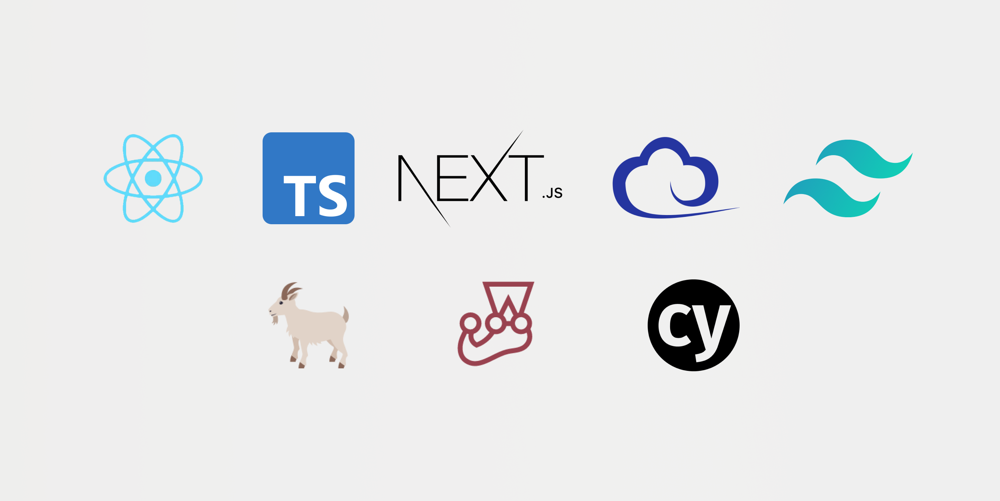

# React, TypeScript, Next.js, Tailwind CSS - Boilerplate

A skeleton project with everything you need to get started with a production ready front-end application.

Includes setup for:
- React
- TypeScript
- Next.js
- Tailwind CSS
- Jest
- React Testing Library
- Cypress

## Prerequisites

### Install dependencies
`npm install`

## Running the application
### Development
`npm run dev`
      
### Production
`npm start`

## Testing
### Running unit & integration tests
`npm run test`

### Running end to end (E2E) tests
`npm run test:e2e`